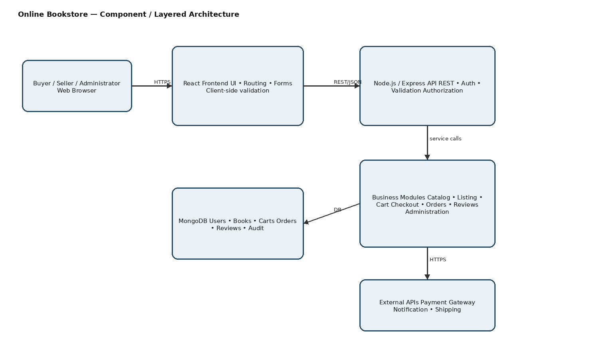
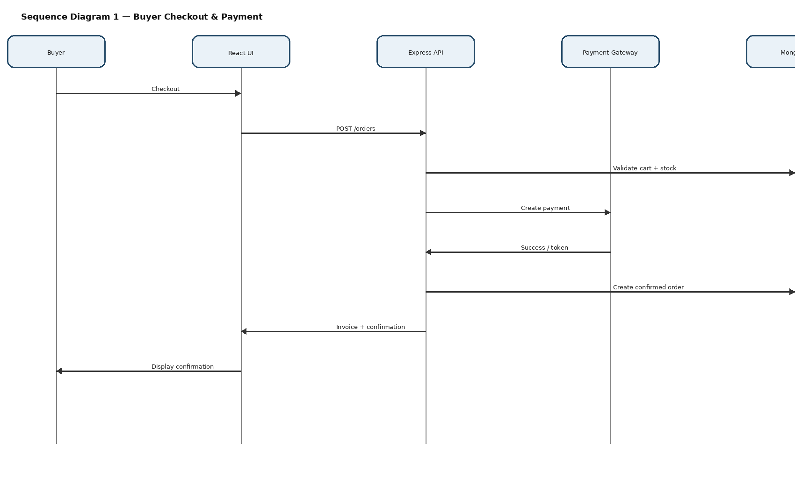
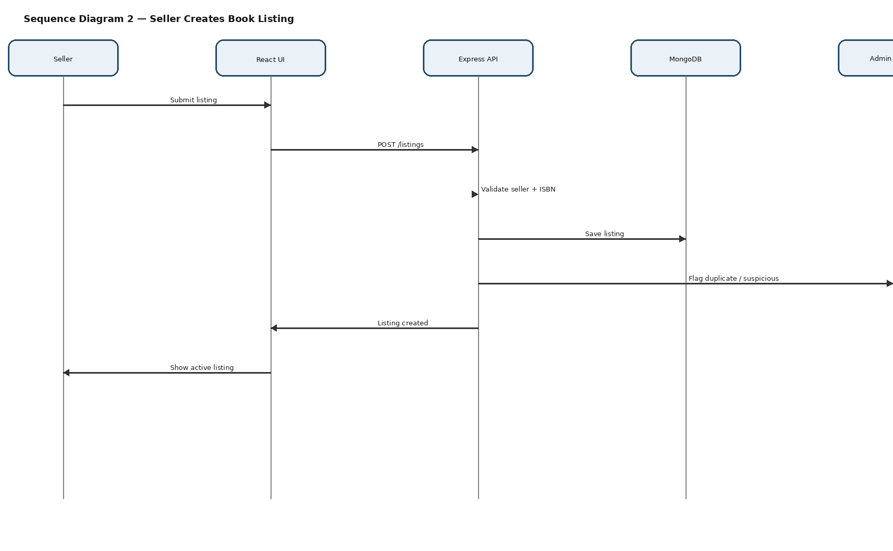
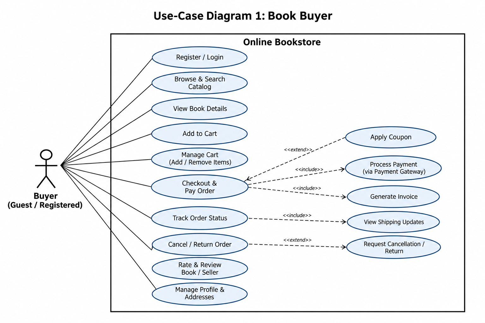
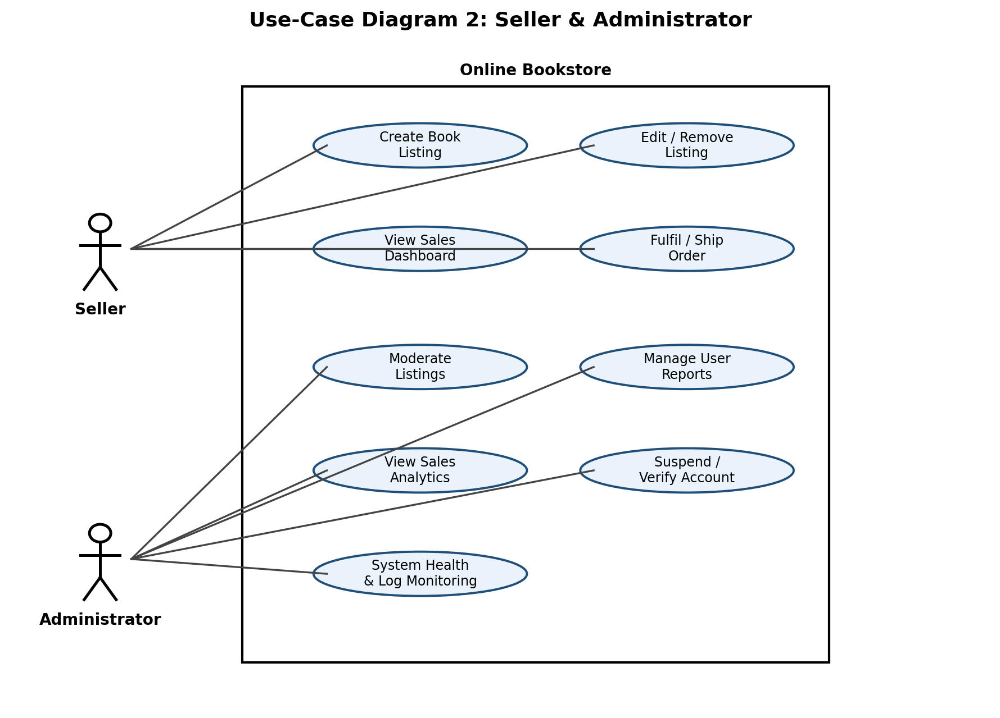

Software Architecture and Design Specification

Online Bookstore

  -----------------------------------------------------------------------
  Field                               Value
  ----------------------------------- -----------------------------------
  Project                             Online Bookstore

  Team                                Team 12

  Members                             Dhanush V Biradar (PES2UG24CS141);
                                      D Sai Karthik (PES2UG24CS155);
                                      Gautam Krishna (PES2UG24CS169); G
                                      Nikhil (PES2UG24CS165)

  Version                             1.0

  Date                                14-09-2026

  Status                              Final
  -----------------------------------------------------------------------

# Revision History

  -----------------------------------------------------------------------
  Version           Date              Author            Change Summary
  ----------------- ----------------- ----------------- -----------------
  1.0               14-09-2026        Team 12           SAD prepared
                                                        using Team 12 SRS
                                                        Version 1.1

  -----------------------------------------------------------------------

# Approvals

  Role                    Name      Signature/Date
  ----------------------- --------- ----------------
  Course Coordinator                
  Team Lead / Architect   Team 12   
  Dev Lead                Team 12   

# 1. Introduction

## 1.1 Purpose

This document specifies the architecture and design of the Online
Bookstore described in the Team 12 SRS. It translates the requirements
into system components, interfaces, security controls, design flows and
traceability.

## 1.2 Scope

Covers buyer browsing, search, cart, checkout, payment, order tracking,
cancellation/returns and reviews; seller listing and sales functions;
and administrator moderation, account management and analytics. Physical
warehousing/logistics and internal third-party service implementation
are outside scope.

## 1.3 Audience

Developers, QA engineers, project mentors, security reviewers and
assessment evaluators.

## 1.4 Definitions

MERN, REST, API, JWT, TLS, OTP, PCI-DSS, XSS, RTM, ISBN, UPI, CVV, PAN.

# 2. Document Overview

## 2.1 How to use this document

Sections 3 and 4 describe the architecture and detailed design. UML
diagrams show the system structure and key interactions. API
definitions, security architecture, risks and traceability provide
implementation guidance.

## 2.2 Related Documents

-   Online Bookstore SRS --- Team 12, Version 1.1, 04-09-2026

-   Software Test Plan for the Online Bookstore

-   SRS Section 8 Requirements Traceability Matrix

# 3. Architecture

## 3.1 Goals & Constraints

-   Secure and modular marketplace for Buyer, Seller and Administrator
    roles.

-   Meet SRS performance target: 90th percentile response ≤3 seconds
    under up to 500 concurrent users.

-   Provide 99.5% monthly uptime excluding scheduled maintenance.

-   Use TLS 1.2+, salted password hashing, payment tokenisation and
    input validation.

-   Dependencies include payment, notification and shipping APIs.

## 3.2 Stakeholders & Concerns

  -----------------------------------------------------------------------
  Stakeholder                         Concerns
  ----------------------------------- -----------------------------------
  Buyer                               Fast search, reliable checkout,
                                      security, order visibility

  Seller                              Listing management, stock accuracy,
                                      sales tracking

  Administrator                       Moderation, account controls,
                                      analytics, auditability

  Developers                          Modularity, maintainability,
                                      scalable services

  QA/Evaluators                       Testability and traceability
  -----------------------------------------------------------------------

## 3.3 Component (UML) Diagram

Figure 1. Component / layered architecture of the Online Bookstore.

## 3.4 Component Descriptions

  -----------------------------------------------------------------------
  Component                           Responsibility
  ----------------------------------- -----------------------------------
  React Frontend                      Responsive UI, routing, forms,
                                      client validation and state.

  Node.js / Express API               REST endpoints, authentication,
                                      authorization, validation and
                                      orchestration.

  Business Services                   Catalog, cart, checkout, orders,
                                      reviews, seller and admin logic.

  MongoDB                             Users, listings, carts, orders,
                                      reviews and audit data.

  Payment Gateway                     External payment processing;
                                      application receives status/token,
                                      not raw card data.

  Notification Service                Order confirmations, OTPs and
                                      alerts.

  Shipping API                        Order tracking updates; may be
                                      simulated for course project.
  -----------------------------------------------------------------------

## 3.5 Chosen Architecture Pattern and Rationale

Layered architecture is chosen: React presentation, Node.js/Express
API/application, business services and MongoDB persistence, with
controlled external integrations. This matches the MERN stack stated in
the SRS, separates responsibilities, simplifies testing and supports
horizontal scaling. Full microservices deployment is unnecessary for the
course scope.

## 3.6 Technology Stack & Data Stores

  Area                Choice
  ------------------- --------------------------------------------
  Frontend            React
  Backend             Node.js + Express
  Database            MongoDB
  Communication       REST/JSON over TLS 1.2+
  Authentication      JWT; bcrypt/Argon2 salted hashes
  External Services   Payment, Email/Notification, Shipping APIs
  Deployment          Cloud VM/container platform

## 3.7 Risks & Mitigations

  -----------------------------------------------------------------------
  Risk                                Mitigation
  ----------------------------------- -----------------------------------
  Payment failure                     Confirm order only after successful
                                      payment confirmation.

  Shipping API unavailable            Use latest known status or
                                      simulated API for testing.

  Traffic spikes                      Horizontally scale catalog/order
                                      services and use indexed search.

  Credential attacks                  TLS, hashing, 5-failure/15-minute
                                      lockout and audit logging.

  Injection/XSS                       Client/server validation and
                                      sanitisation; security scanning.
  -----------------------------------------------------------------------

## 3.8 Traceability to Requirements

  Requirement Group   Architecture Mapping
  ------------------- ------------------------------------------------
  BOOK-F-001..004     Auth Service / User module
  BOOK-F-005..008     Catalog/Search
  BOOK-F-009..012     Listing Service / Seller dashboard
  BOOK-F-013..016     Cart + Checkout + Payment
  BOOK-F-017..019     Order + Shipping
  BOOK-F-020..021     Reviews
  BOOK-F-022..023     Admin / Analytics
  BOOK-NF-001..005    Performance, infrastructure, UI, scalability
  BOOK-SR-001..005    Network, Auth, Payment and validation security

## 3.9 Security Architecture

  -----------------------------------------------------------------------
  Threat                              Control
  ----------------------------------- -----------------------------------
  Spoofing                            JWT, password hashing, email
                                      verification, account lockout

  Tampering                           Authorization,
                                      validation/sanitisation, controlled
                                      updates, audit logs

  Repudiation                         Audit logging without sensitive
                                      credentials

  Information Disclosure              TLS, least privilege, no raw
                                      PAN/CVV storage

  Denial of Service                   Authentication rate
                                      limiting/lockout and scalable
                                      services

  Elevation of Privilege              Role-based authorization
  -----------------------------------------------------------------------

# 4. Design

## 4.1 Design Overview

Requests enter through the React UI and Express API, are authenticated
and validated, processed by the relevant business module, persisted in
MongoDB, and integrated with external services when required.

## 4.2 UML Sequence Diagrams

Sequence Diagram 1 --- Buyer Checkout & Payment: Buyer → React UI →
Express API → Payment Gateway → MongoDB → confirmation/invoice.

Sequence Diagram 2 --- Seller Creates Book Listing: Seller → React UI →
Express API → MongoDB, with duplicate/suspicious listing flags sent to
the Admin moderation queue.

## 4.3 API Design

  ------------------------------------------------------------------------------------------------------------------------------
  Endpoint                  Method            Request                                                Response / Errors
  ------------------------- ----------------- ------------------------------------------------------ ---------------------------
  /api/auth/login           POST              {email,password}                                       {token,user}; 401 invalid
                                                                                                     credentials; 423 locked

  /api/listings             POST              {title,author,isbn,price,condition,coverImage,stock}   {listingId,status}; 400
                                                                                                     validation; 401/403 auth

  /api/orders               POST              {cartId,addressId,paymentMethod}                       {orderId,paymentStatus};
                                                                                                     payment failure leaves
                                                                                                     order unconfirmed

  /api/orders/{id}/status   GET               Authenticated order ID                                 {status,shippingUpdates};
                                                                                                     401/404 errors
  ------------------------------------------------------------------------------------------------------------------------------

Authenticated calls use JWT-based session tokens. Client-server and
third-party traffic uses TLS 1.2+.

## 4.4 Error Handling, Logging & Monitoring

-   Use consistent HTTP status codes and safe user messages.

-   Never log passwords, CVV, raw card numbers or authentication
    secrets.

-   Audit security/moderation actions.

-   Monitor response time, payment failures, authentication failures,
    order errors and uptime.

## 4.5 UX Design

Responsive UI for mobile, tablet and desktop. Main navigation: Home,
Catalog, Cart, Orders, Seller Dashboard and Admin Panel. Forms use clear
labels, readable contrast and validation feedback.

## 4.6 Open Issues & Next Steps

-   Configure the actual payment gateway.

-   Select final notification and shipping providers.

-   Finalize deployment, backup and monitoring configuration.

-   Expand DS-\* design references as implementation modules are built.

-   Execute STP cases and update RTM status with evidence.

# 5. Appendices

## 5.1 Glossary

  Term      Meaning
  --------- ----------------------------------------------
  MERN      MongoDB, Express, React, Node.js
  REST      Representational State Transfer
  JWT       JSON Web Token
  TLS       Transport Layer Security
  PCI-DSS   Payment Card Industry Data Security Standard
  XSS       Cross-Site Scripting
  RTM       Requirements Traceability Matrix

## 5.2 References

-   Online Bookstore SRS --- Team 12, Version 1.1, 04-09-2026

-   SRS Sections 4--6 and Section 8 RTM

## 5.3 Tools

PlantUML/draw.io-style UML notation, Swagger/OpenAPI for API
documentation, and Git/GitHub for version control.

# Appendix A --- SRS Use-Case Diagrams

These are the approved use-case diagrams carried forward from the Team
12 SRS and used as the functional context for this design.

Figure A1. Use-Case Diagram 1 --- Book Buyer.

Figure A2. Use-Case Diagram 2 --- Seller & Administrator.

## 3.10 Architecture Decision Record (ADR)

ADR-001 --- Choice of Layered Architecture

Status: Accepted

Context: The Online Bookstore requires modularity, maintainability,
clear separation of responsibilities and practical scalability while
remaining manageable within the course-project scope.

Decision: Use a layered architecture consisting of a React presentation
layer, Node.js/Express API/application layer, business-service layer and
MongoDB persistence, with controlled integrations to payment,
notification and shipping services.

Alternatives considered: A full microservices architecture was
considered but rejected for the current scope because it would introduce
additional deployment and operational complexity without a demonstrated
need.

Consequences: This simplifies development, testing, deployment and
maintenance and provides a clear path for scaling high-load services.
The trade-off is less independent deployability than a full
microservices architecture.
